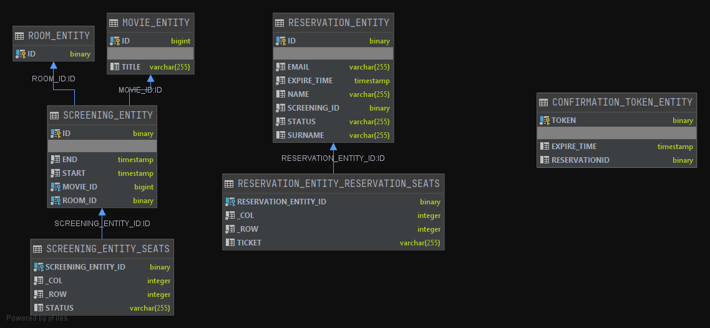
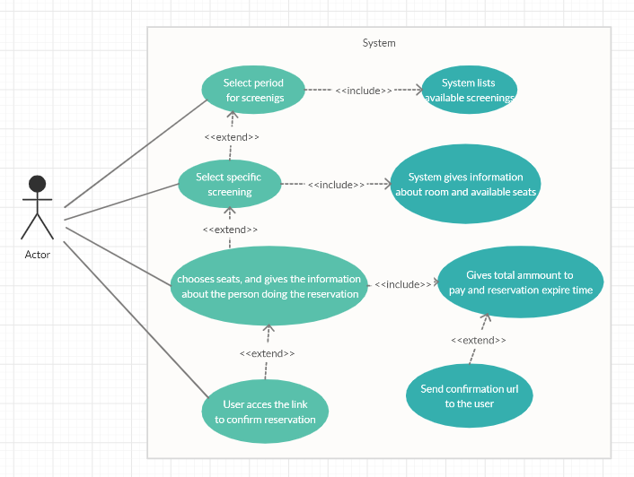

# Booking-App

Ticket booking app
The goal is to build a seat reservation system for a multiplex.

Business use case:
1. The user selects the day and the time when he/she would like to see the movie.
2. The system lists movies available in the given time interval
3. The user chooses a particular screening.
4. The system gives information regarding screening room and available seats.
5. The user chooses seats, and gives the information about the person doing the reservation
6. The system gives back the total amount to pay and reservation expiration time.
7. In the last step, in addition to the total amount and reservation expiration time, a
confirmation link
should also be given (by email)
8. User accesses the link to confirm reservation

Assumptions:
1. The system covers a single cinema with multiple rooms (multiplex).
2. Seats can be booked at latest 15 minutes before the screening begins.
3. Screenings given in point 2. of the scenario should be sorted by title and screening
time.
4. There are three ticket types: adult (25 PLN), student (18 PLN), child (12.50 PLN).

Requirements:
1. The data in the system should be valid, in particular:
    1. name and surname should each be at least three characters long, starting
with a capital letter. The surname could consist of two parts separated with a
single dash, in this case the second part should also start with a capital letter.
    2. reservation applies to at least one seat.
2. There cannot be a single place left over in a row between two already reserved
places.
3. The system should properly handle Polish characters.
4. If the user does not confirm the reservation in 15 minutes (but not later than 15
minutes before the screening), the system should cancel the reservation. 
5. Reservation cancellation should happen in two cases:
    1. 15 minutes after the reservation is made,
    2. 15 minutes before the screening.
### How to build and run?

#### Requirements

* Java 14
* Maven

### Database diagram



### Use case diagram



#### Quickstart

You can run the booking app by simply typing the following:

Normal:
```console
$ ./mvnw spring-boot:run
```

With test data:
```console
$ ./mvnw spring-boot:run -Dspring.profiles.active=test_data
```

Run unit tests:
```console
$ ./mvnw test
```


Would you like to hire me?